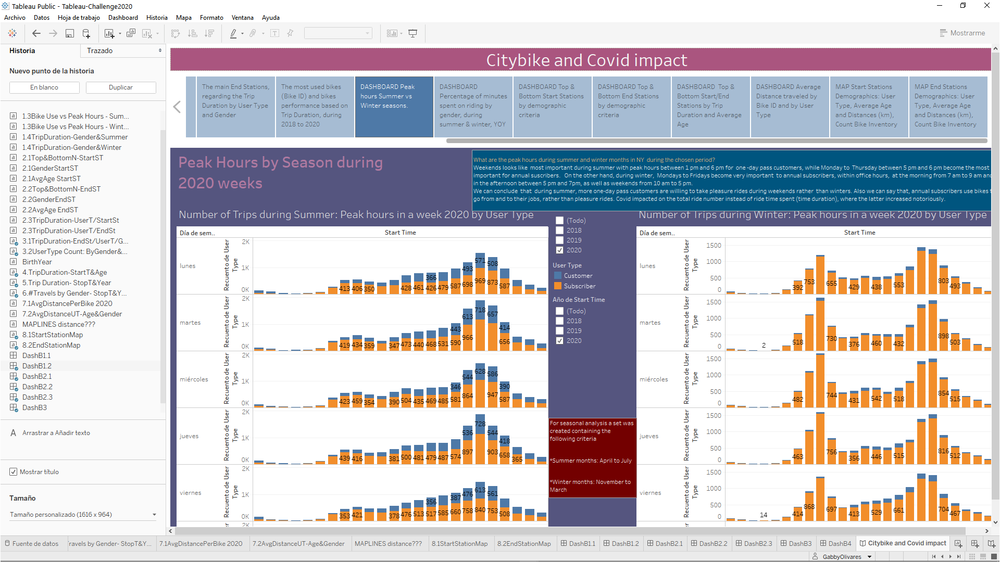

# Tableau Homework - Citi Bike and Covid Impact Analytics

### CHALLENGE COMPLETED!

Check out my Story at my Tableau Public Website [here](https://public.tableau.com/profile/gabbyolivares#!/vizhome/Tableau-Challenge2020/CitybikeandCovidimpact?publish=yes).

## Background
As the new lead analyst for the [New York Citi Bike](https://en.wikipedia.org/wiki/Citi_Bike) Program, I am now responsible for overseeing the largest bike sharing program in the United States. In my new role, I am expected to generate regular reports for city officials looking to publicize and improve the city program.

Since 2013, the Citi Bike Program has implemented a robust infrastructure for collecting data on the program's utilization. Through the team's efforts, each month bike data is collected, organized, and made public on the [Citi Bike Data](https://www.citibikenyc.com/system-data) webpage.

However, while the data has been regularly updated, the team has yet to implement a dashboard or sophisticated reporting process. City officials have a number of questions on the program.

As my first task  is to build a set of data reports to provide the answers to several questions by structuring and analyzing the data with the following criteria:

## Task

**Aggregate the data found in the Citi Bike Trip History Logs and find unexpected phenomena.** 

**Designed 15 visualizations for each discovered phenomena, I was on fire!.** 

* Time span chosen: January to November 2018-2020

* Built my Data set on jupyter notebook, where I performed Data cleaning, edition and concatenation.

* I merged multiple datasets from different periods, following the criteria to build one month csv with 3 years each one, summarizing a total of 11 csv's containing one month data from 2018 to 2020.

* I standardized the column headers and data types. Combined and created Data frames, rename columns, convert date times and create new csv's.

* Then, in Tableu, I performed the Union of the 11 csv's in a way that only add up the rows, but not add columns. 

**The following are some, from other questions I tackle:**

* How many trips have been recorded total during the chosen period?

* How has the proportion of short-term customers and annual subscribers changed?

* What are the peak hours in which bikes are used during summer and winter months?

* Today, what are the top/bottom 10 stations in the city for starting a journey? 

* Today, what are the top/bottom 10 stations in the city for ending a journey? (Based on data, why?)

* Today, what is the gender breakdown of active participants (Male v. Female)?

* What is the average distance in miles that a bike is ridden?

* How effective has gender outreach been in increasing female ridership over the timespan?

* How does the average trip duration change by age?

* Which bikes (by ID) are most likely due for repair or inspection in the timespan?

* How variable is the utilization by bike ID?

**AMONG MANY MORE VISUALIZATIONS!!...**

**Next, as a chronic over-achiever:**

* I Used my visualizations to design a dashboard explaining the Citibike behaviour and trends with the Covid impact on it's performance, comparing 2020 with the two previous years.

* The dashboards are accompanied with an analysis explaining why the Covid has impacted, positively and also negatively to the riders, and how has changed the user type - age - gender mix of the bike riders.

**Performed different visualizations:**

* **Basic:** A static map that plots all bike stations with a visual indication of the most popular locations to start and end a journey with zip code data overlaid on top.

* **Advanced:** A dynamic map that shows how each station's popularity changes over time (by month and year). Again, with zip code data overlaid on the map.

* The map I choose also contains write-up unveiling trends that were noticed during my analysis.

**Finally, create my final presentation**

* Created a Tableau story that brings together the visualizations, requested maps, and dashboards.

## Considerations

As my audience will be city officials, public administrators, and heads of New York City departments, My data and analysis will be presented in a way that is focused, concise, easy-to-understand, and visually compelling. 

My visualizations contain trends, insights and recommendations, enough to be included in press releases.

## Submission 

My final submission includes:

* My Tableau Public link to my workbook that includes: 
  * 15 Total "Phenomenon" Visualizations 
  * 7 Dashboards
  * 2 City Official Map
  * 1 Story 
* A text or markdown file with my analysis on the phenomenons I uncovered from the data.

## Sharing My Work
In order to share my work, I saved as a .twbx file so that your TA's can grade them.

To save your workbook as a .twbx file (just selected "Save As..." from the "File" dropdown. Then, select the .twbx option)

## Assessment

Final product will be assessed on the following metrics:

* Analytic Rigor

* Readability

* Visual Attraction

## Resources

[Tableau Scatter Plot](https://www.youtube.com/watch?v=KuwLzBmRaIs) 

[Tableau Scatter Plot](https://interworks.com/blog/ccapitula/2015/04/30/tableau-essentials-calculated-fields-type-conversion/)

[Tableau Calculated Fields](https://interworks.com/blog/ccapitula/2015/04/30/tableau-essentials-calculated-fields-type-conversion/)

[Tableau Destination Map with more than one stop](https://www.youtube.com/watch?v=D1FEve2-3cE)

## Challenge milestones!

* Combined each of the CSV files and manipulate it with my jupyter notebook to have the data as good as needed to perform a great analysis. I Dig for an approach that worked and just go with the outcomes I was looking for!

* Adjustede the CSV formats, since I noticed not all of them was standardized. I found subtle changes to the formats in the columns that can blockade my analysis. 

* I ensure my data was consistent and clean throughout my analysis. 

* First, I built my visualizations with small extracts of the data (i.e. single files cotaining one year and one month) before attempting to import the whole thing.

* Was VERY CHALLENGING to import 11 ,months from the complete 3 years (2018 - 2020) I found myself with performance issues such as reading slow, but most of all, not reading the complete data set!

* I accompanied my data visualizations with clear and directed answers and analysis.

* I look to answer each question,  in a way that is concize, organized and presentable.

* I spent quite a good time thinking through decisions on color schemes, fonts, and visual story-telling. I look for ways to have your data visualizations match their aesthetic tones and changed formats in many times :D

* I create calculated fields to get the information I needed. Worked with LOD and found I need more time to become expert on the theme!

* I considered adding other pieces of information on socioeconomic or other geographic data. I used the Tableau map "layer" to feature extra information.

* I look for new tricks and tips from Youtube to perform some aggregate functions in Tableau. Explored new concepts and push my creativity the most!

* Thanks for the challenge!
 
 
 

### Copyright

##### © 2020 Gabriela Loami Olivares Martinez, BootCamp Tecnologico de Monterrey.
##### © 2020 Trilogy Education Services, a 2U, Inc. brand. All Rights Reserved. 
